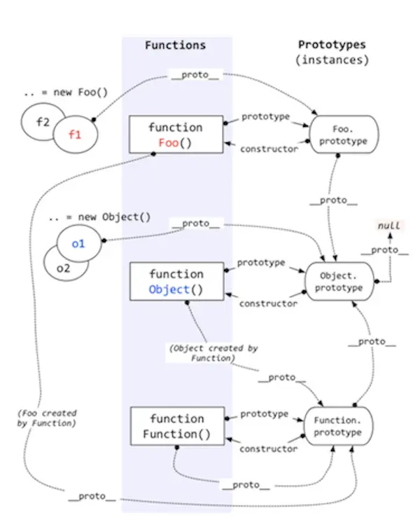

> 解读
>  1. 每个构造函数函数都有一个 prototype 属性，就是我们经常在各种例子中看到的那个 prototype
>  2. 每个实例化对象 都有有一个__proto__ 属性， 指向构造函数的prototype
>  3. 当读取实例的属性时，如果找不到，就会查找与对象关联的原型中的属性，如果还查不到，就去找原型的原型，一直找到最顶层为止。
>  4. 最顶层为 Object.prototype.__proto__ 指向 null

### 面试题1. instanceof 原理
```javascript
function new_instance_of(leftVaule, rightVaule) { 
    let rightProto = rightVaule.prototype; // 取右表达式的 prototype 值
    leftVaule = leftVaule.__proto__; // 取左表达式的__proto__值
    while (true) {
    	if (leftVaule === null) {
            return false;	
        }
        if (leftVaule === rightProto) {
            return true;	
        } 
        leftVaule = leftVaule.__proto__ 
    }
}
```

### 面试题2. new 操作符
```javascript
function objectFactory() {

    var obj = new Object(),

    Constructor = [].shift.call(arguments);

    obj.__proto__ = Constructor.prototype;

    var ret = Constructor.apply(obj, arguments);

    return typeof ret === 'object' ? ret : obj;

};
```
